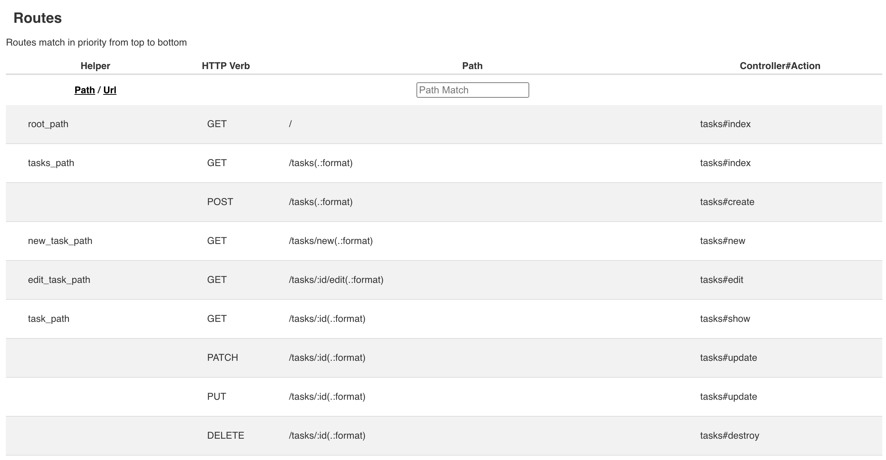

# タスク管理アプリケーションを作ろう

> 参考: 現場で使える Ruby on Rails 5速習実践ガイド Chapter 3 p.81

Chapter3からChapter8にかけて、タスク管理アプリケーションの開発を通してRailsについて学んでいきます。

Chapter3ではCRUD機能を備えたアプリケーションをscaffoldを使わずに実装していきます。実装を通して、Railsの機能や規約について学んでいきます。

また、公式のサポートサイトでは各Chapter完了時点のソースコードがダウンロードできます。
手元で動かない場合などはそちらも参考にしてみてください。

[『現場で使える Ruby on Rails 5速習実践ガイド』サポートサイト | マイナビブックス](https://book.mynavi.jp/supportsite/detail/9784839962227.html)

## アプリケーション作成の準備をしよう

> 参考: 現場で使える Ruby on Rails 5速習実践ガイド Chapter 3-1 p.82

ここでは以下の3つを行います。

- アプリケーションのひな形を作る
- 開発環境のDBを準備する
- view を実装するにあたって利用する gem を導入する

### アプリケーションのひな形を作る

前回と同じく `rails new` コマンドを使ってアプリケーションのひな形を作成します。

今回は Ruby 2.5.1, Rails 5.2.1 を使っていくため、以下のようにバージョンを指定した上で `rails new` コマンドを実行してください。

※ 書籍とは異なる点なのでご注意ください

```sh
$ rbenv shell 2.5.1
$ rails _5.2.1_ new taskleaf -d postgresql
```

### 開発環境のDBを準備する

書籍内ではMacにインストールしたPostgreSQLを利用していますが、今回はそちらでなく、Dockerコンテナ上のPostgreSQLを利用します。
そのため、`$ bin/rails db:create` を実行する前に DB の準備をしていきます。

このドキュメントと同じ階層にある `docker-compose.yml` を作成したアプリケーション（この場合はtaskleafディレクトリの中）にコピーしてください。
コピーしたら `docker-compose up` を実行してDocker上にDBを立ち上げます。

```sh
$ docker-compose up
```

Docker上のDBに接続するため、RailsアプリケーションのDB接続情報を変更します。 config/database.ymlを編集し、default内にhostやport情報を追記します。

```yaml
default: &default
  adapter: postgresql
  encoding: unicode
  # For details on connection pooling, see Rails configuration guide
  # https://guides.rubyonrails.org/configuring.html#database-pooling
  pool: <%= ENV.fetch("RAILS_MAX_THREADS") { 5 } %>
  host: localhost # <-- 追加
  port: 54321     # <-- 追加
  username: root  # <-- 追加
  password: root  # <-- 追加
  :
  :
```

続いて、動作確認もかねてDB上にデータベースを作成します。

```sh
$ ./bin/rails db:create
```

その後、次のコマンドでPostgreSQLのターミナルへ接続できれば成功です。

```sh
$ ./bin/rails db
Password for user root: # <--- パスワード（今回はroot）を入力する
psql (12.3, server 10.13 (Debian 10.13-1.pgdg90+1))
Type "help" for help.

taskleaf_development=# \l taskleaf*
                                   List of databases
         Name         | Owner | Encoding |  Collate   |   Ctype    | Access privileges
----------------------+-------+----------+------------+------------+-------------------
 taskleaf_development | root  | UTF8     | en_US.utf8 | en_US.utf8 |
 taskleaf_test        | root  | UTF8     | en_US.utf8 | en_US.utf8 |
(2 rows)

taskleaf_development-# \q
```

### Bootstrap

- フロントエンドフレームワークのひとつ
- Rails5とRails6では導入方法に違いがあります
  - Rails5までは bundler 経由で bootstrap gem を導入します
    - 今回はこちらの方法を使います
  - Rails6以降では npm/yarn 経由で bootstrap npm パッケージを導入します

## タスクモデルを作成する

> 参考: 現場で使える Ruby on Rails 5速習実践ガイド Chapter 3-2 p.92

ここではRailsにおける基本的なモデルの作成を行っています。

- `bin/rails generate model` コマンドによるモデル関連ファイルの生成
- マイグレーションによるテーブルの追加

また、Rails の規約についてもいくつか触れられています。

- モデルクラスは単数系（例: `Task`）
- テーブルはモデルクラス名の複数形（例: `tasks`）
- `id`, `created_at`, `updated_at` が自動的に用意される

## コントローラとビュー

> 参考: 現場で使える Ruby on Rails 5速習実践ガイド Chapter 3-3 p.96

CRUDの各画面を作成しながら、コントローラとビューに関連するRailsの基本的な機能について紹介しています。

- `bin/rails generate controller` コマンドによるコントローラ、ビュー、ルーティングの生成
- HTTPリクエストからレスポンスまでのRails内での一連の流れの把握
- Railsのルーティングについての簡単な紹介
- コントローラ内のメソッド（アクション）とビューの紐付けについての規約
- リクエストパラメータについて
- レンダーとリダイレクトについて
- Flashメッセージについて
- パーシャルについて

### ルーティングの確認について

`config/routes.rb` で定義したルーティングを確認するには以下の二通りの方法があります。
どちらも表示される内容は一緒です。

#### `bin/rails routes` コマンドを実行する

```sh
$ bin/rails routes
   Prefix Verb   URI Pattern                 Controller#Action
     root GET    /                           tasks#index
    tasks GET    /tasks(.:format)            tasks#index
          POST   /tasks(.:format)            tasks#create
 new_task GET    /tasks/new(.:format)        tasks#new
edit_task GET    /tasks/:id/edit(.:format)   tasks#edit
     task GET    /tasks/:id(.:format)        tasks#show
          PATCH  /tasks/:id(.:format)        tasks#update
          PUT    /tasks/:id(.:format)        tasks#update
          DELETE /tasks/:id(.:format)        tasks#destroy
...
```

#### `/rails/info/routes` へアクセスする

rails を起動した状態で http://localhost:3000/rails/info/routes にアクセスするとルーティングの定義が表示されます。


